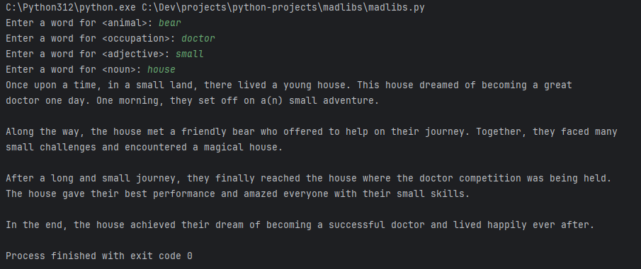

# MadLibs Project
This is a simple madlibs project that takes a story setup in standard madlibs
format and prompts user for inputs and then outputs story with those inputs.

## Story
The story goes into a `story.txt` file with the input words in a format like: `<word>`

## Example
