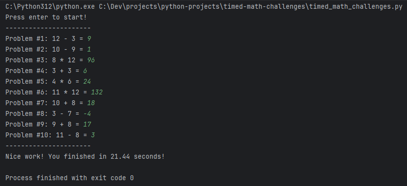

# Timed Math Challenges Project
This is a simple CLI application that generates random math problems for the user to solve.
The user is timed and will receive their total time at the end/completion of problems.

## Settings
- OPERATORS = +, -, *
- MIN_OPERAND = 3
- MAX_OPERAND = 12
- TOTAL_PROBLEMS = 10

## Example
